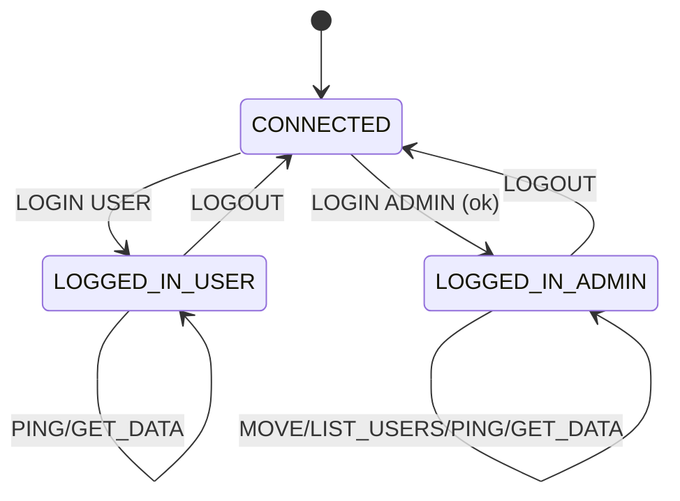

# Guía Educativa de la Entrega 1: Robot de Telemetría

Este documento es un tutorial exhaustivo de la solución para la "Entrega 1". Su objetivo es enseñar desde cero los conceptos de programación de redes, arquitectura de software y concurrencia aplicados en la construcción de este proyecto.

**Ubicación del Proyecto:** `/home/666/UNIVERSIDAD/Telematica/telemetria_robot/`

---

## 1. Fundamentos: El Modelo Cliente-Servidor y TCP

Antes de ver el código, es crucial entender el modelo sobre el que se construye todo el sistema.

*   **Modelo Cliente-Servidor:** Es la arquitectura de red más común. Un programa, el **servidor**, ofrece un servicio (en nuestro caso, datos del robot y control de movimiento). Otros programas, los **clientes**, se conectan a él para consumir ese servicio. El servidor es pasivo (espera conexiones), mientras que los clientes son activos (inician las conexiones).

*   **Protocolo de Transporte - TCP:** Para la comunicación, elegimos el **Protocolo de Control de Transmisión (TCP)**. ¿Por qué? Porque TCP es **fiable y orientado a la conexión**.
    *   **Orientado a la conexión:** Antes de enviar datos, cliente y servidor realizan un "apretón de manos" (three-way handshake) para establecer una conexión estable. Es como hacer una llamada telefónica antes de empezar a hablar.
    *   **Fiable:** TCP garantiza que los datos enviados llegarán al destino, en el orden correcto y sin errores. Si un paquete se pierde, TCP se encarga de retransmitirlo. Para una aplicación de control como esta, donde un comando perdido (`MOVE UP`) puede ser crítico, la fiabilidad es indispensable.

---

## 2. El Protocolo de Aplicación: El Lenguaje del Robot

El archivo `README.md` define nuestro **protocolo de capa de aplicación**. Este es el "idioma" que hemos inventado para que los clientes y el servidor se entiendan. Es un protocolo basado en texto, lo que significa que los mensajes son legibles por humanos (ej. `LOGIN ADMIN ...`).

**Justificación del Diseño:**

*   `LOGIN <rol> <pass>`: Es el primer paso para establecer una sesión a nivel de aplicación. Permite al servidor saber quién es el cliente y qué permisos tiene, implementando la seguridad y la distinción de roles.
*   `DATA <timestamp> ...`: El servidor "empuja" (push) estos datos periódicamente. El cliente no necesita pedirlos cada vez, lo que es eficiente para un flujo de telemetría en tiempo real.
*   `MOVE <dir>`: Comandos simples y claros para el control del robot.
*   `MOVE_FAIL ... OBSTACLE`: La retroalimentación del servidor es crucial. No basta con enviar un comando; el cliente necesita saber si tuvo éxito o por qué falló.

---

## 3. El Servidor en C: `server.c` - El Corazón del Sistema

El servidor es la pieza más compleja. Está escrito en C para un control de bajo nivel del sistema operativo y un alto rendimiento.

### 3.1. Arquitectura: Concurrencia con Hilos (pthreads)

Un servidor real debe atender a muchos clientes a la vez. Si atendiéramos a un cliente a la vez, todos los demás tendrían que esperar. Para solucionar esto, usamos **concurrencia**.

*   **¿Por qué hilos?** Cuando un nuevo cliente se conecta, el servidor principal crea un **hilo** (`pthread`) dedicado exclusivamente a ese cliente. Un hilo es como un sub-proceso ligero que comparte memoria con el proceso principal. Esto es muy eficiente porque:
    1.  Crear un hilo es mucho más rápido que crear un proceso (`fork()`).
    2.  Todos los hilos pueden acceder a una lista compartida de clientes (protegida por un `mutex` para evitar condiciones de carrera), lo que es ideal para enviar telemetría a todos a la vez.

### 3.2. Desglose del Código y las Llamadas al Sistema

El flujo de trabajo de un servidor TCP es un patrón clásico:

1.  **`socket()`**: Llama al sistema operativo y le pide "dame un nuevo socket". El SO crea la estructura de datos interna y nos devuelve un "descriptor de archivo" (un número entero), que es como el ID de nuestro socket.

2.  **`bind()`**: Le dice al SO: "Quiero que este socket que me diste esté asociado a esta dirección IP y a este puerto". Es el paso de "abrir la tienda" en una dirección específica.

3.  **`listen()`**: Le dice al SO: "Ahora que la tienda está abierta, pon este socket en modo de escucha pasiva. Estoy listo para aceptar clientes". El segundo argumento (ej. `5`) define el tamaño de la cola de conexiones pendientes.

4.  **`accept()`**: Esta es una llamada **bloqueante**. El programa se detiene aquí, esperando a que un cliente se conecte. Cuando un cliente llega, `accept()` crea un **nuevo socket** dedicado a la comunicación con ese cliente y devuelve su descriptor de archivo. El socket original permanece escuchando por nuevos clientes.

5.  **`pthread_create()`**: Aquí ocurre la magia de la concurrencia. En lugar de manejar al cliente en el bucle principal, creamos un nuevo hilo y le pasamos el descriptor del nuevo socket. Ese hilo se encargará de la comunicación (`read`/`write`) con ese cliente en particular, mientras el bucle principal vuelve inmediatamente a `accept()`, listo para el siguiente cliente.

### 3.3. Compilación con el `Makefile`

*   **Comando:** `make`
*   **Justificación:** Compilar un programa en C que usa hilos requiere enlazar la librería `pthread`. El `Makefile` automatiza esto, ejecutando `gcc -pthread -o server server.c`. La bandera `-pthread` le dice al enlazador que incluya el código de la librería de hilos, sin la cual el programa no funcionaría.

---

## 4. Los Clientes en Python: Consumiendo el Servicio

Los clientes demuestran cómo cualquier aplicación, en cualquier lenguaje, puede interactuar con nuestro servidor si "habla" el protocolo que definimos.

### 4.1. Cliente de Consola: `client_cli.py`

Este cliente muestra un desafío interesante: ¿cómo puede el usuario escribir comandos al mismo tiempo que el servidor envía mensajes de telemetría inesperados?

*   **Solución: Hilos (de nuevo).**
    1.  El **hilo principal** se dedica a una única cosa: esperar la entrada del usuario (`input()`).
    2.  Se crea un **hilo secundario** (`receive_thread`) que se dedica a otra única cosa: esperar (`sock.recv()`) por mensajes que llegan desde el servidor. Cuando llega un mensaje, lo imprime en la pantalla.

    Esta arquitectura de dos hilos desacopla la entrada del usuario de la salida del servidor, permitiendo que ambas ocurran simultáneamente sin interferir entre sí.

### 4.2. Cliente Gráfico: `client_gui.py`

Este cliente muestra cómo integrar el protocolo de red en una aplicación de escritorio con una interfaz gráfica (GUI) usando `tkinter`.

*   **Concepto: Bucle de Eventos (Event Loop).** Las aplicaciones GUI funcionan con un "bucle de eventos". El programa espera a que ocurran eventos (clic de botón, entrada de texto) y ejecuta funciones (callbacks) en respuesta. Este bucle es bloqueante por naturaleza.

*   **El Problema:** Si llamamos a `sock.recv()` (que es bloqueante) en el hilo principal de la GUI, toda la interfaz se congelaría mientras espera un mensaje del servidor.

*   **Solución: ¡Hilos, una vez más!** Al igual que en el cliente de consola, la comunicación de red se delega a un **hilo secundario**. Cuando este hilo recibe un mensaje del servidor, no lo imprime directamente, sino que lo inserta de forma segura en el área de texto de la GUI. Esto mantiene la interfaz fluida y receptiva en todo momento.

---

## 5. Guía de Ejecución (Resumen Justificado)

1.  **Compilar el Servidor (`make`):** Se traduce el código C a un ejecutable que la máquina pueda entender, incluyendo las librerías necesarias.
2.  **Ejecutar el Servidor (`./server 8080 logs.txt`):** Se inicia el programa, que se vincula al puerto 8080 y se prepara para aceptar clientes.
3.  **Ejecutar un Cliente (`python3 client_cli.py 127.0.0.1 8080`):** Se inicia el programa cliente, que establece una conexión TCP con el servidor en la IP y puerto especificados, listo para enviar y recibir datos según el protocolo definido.

---

## Diagramas

### Secuencia Cliente-Servidor

```mermaid
sequenceDiagram
  participant C as Cliente
  participant S as Servidor
  C->>S: TCP connect
  C->>S: LOGIN USER | ADMIN
  S-->>C: LOGIN_SUCCESS / LOGIN_FAIL
  loop cada 15s
    S-->>C: DATA timestamp VAR=VAL;...
  end
  C->>S: MOVE DIR
  S-->>C: MOVE_SUCCESS/MOVE_FAIL
  C->>S: LOGOUT
  S-->>C: close
```

### Estados de Sesión


