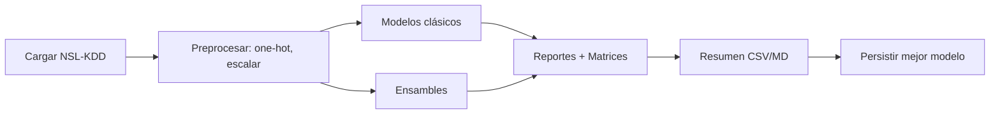

# CiberTelepatia — Detección de Intrusiones con ML (Extra)

Este módulo añade una solución completa de Machine Learning (ML) sobre el conjunto de datos NSL-KDD para Detección de Intrusiones (IDS), con:

- Análisis Exploratorio de Datos (EDA) visual en Plotly.
- Entrenamiento y evaluación de 10+ modelos clásicos.
- 3 métodos de ensamble (Voting, Stacking, Bagging).
- Resultados, métricas y gráficos interactivos.

## Requisitos

- Python 3.9+ (recomendado 3.11 o superior)
- Instalar dependencias:

```
pip install -r CiberTelepatia/requirements.txt
```

## Ejecutar el Notebook

1. Inicia Jupyter:

```
jupyter notebook
```

2. Abre `CiberTelepatia/notebooks/IDS_Analysis_and_Models.ipynb` y ejecuta las celdas en orden. Las figuras se mostrarán en el notebook y también se guardarán en `CiberTelepatia/outputs/` cuando aplique.

## Ejecutar por Línea de Comandos (opcional)

También puedes correr un flujo equivalente sin notebook:

```
python CiberTelepatia/run_ids_ml.py
```

Esto descargará los datos, entrenará los modelos, imprimirá métricas y guardará resultados en `CiberTelepatia/outputs/`.

## Datos

Se usan las particiones públicas del dataset NSL-KDD:
- Train: `KDDTrain+.txt`
- Test: `KDDTest+.txt`

Se descargan automáticamente desde GitHub. Si no tienes internet, descarga los archivos manualmente y ajusta las rutas en el notebook o script.

## Estructura

- `notebooks/IDS_Analysis_and_Models.ipynb`: Notebook principal con EDA y modelos.
- `run_ids_ml.py`: Script CLI para ejecutar el pipeline completo.
- `requirements.txt`: Dependencias necesarias.
- `outputs/`: Carpeta de salida para métricas y gráficos.
- `Analisis_y_Modelado_ML.txt`: Documento pedagógico paso a paso (para público no técnico).

## Notas de rendimiento

Algunos modelos (p. ej. SVC con kernel RBF) pueden ser lentos en todo el dataset. El notebook incluye muestreo racional para mantener los tiempos razonables sin sacrificar calidad del análisis.

## Licencias y uso

El dataset NSL-KDD es de dominio público para investigación académica. Revisa las licencias de las librerías usadas conforme a tus políticas institucionales.

## Reproducibilidad

- Semillas globales fijadas: `numpy.random.seed(42)` y `random.seed(42)` para resultados replicables.
- Algunas bibliotecas externas reciben semillas adicionales donde aplica.

## Preprocesamiento

- Se usa `StandardScaler(with_mean=False)` para compatibilidad con datos dispersos tras one-hot encoding y evitar densificación costosa.

## Diagrama de Flujo del Pipeline



## Salidas

- `outputs/metrics/*`: Reportes de clasificación por modelo (txt).
- `outputs/confusion_matrices/*`: Matrices de confusión (CSV).
- `outputs/plots/*`: Heatmaps de matrices, curvas ROC/PR.
- `outputs/results_summary.csv` y `results_summary.md`.
- `outputs/best_model.joblib`: Mejor modelo persistido (cuando aplica).
