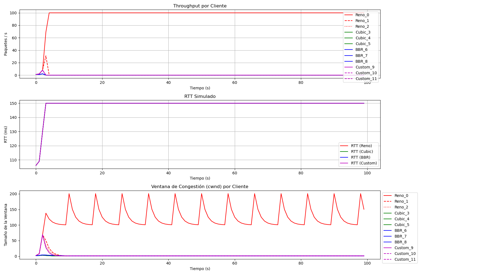

# Informe de Simulación de Control de Congestión TCP

Este documento presenta los resultados y el análisis de la simulación de algoritmos de control de congestión de TCP, correspondiente a la actividad opcional.

---

## 1. Descripción de la Simulación

Se implementó una simulación en Python para modelar un escenario de red donde múltiples clientes compiten por el ancho de banda de un único enlace compartido. El objetivo es observar cómo diferentes algoritmos de control de congestión (Reno, CUBIC, BBR y un algoritmo personalizado) gestionan su ventana de envío (`cwnd`) para maximizar el `throughput` y mantener la equidad.

**Parámetros Clave de la Simulación:**
*   **Tiempo de Simulación:** 100 segundos.
*   **Capacidad del Enlace:** 100 paquetes/segundo.
*   **Tamaño del Búfer del Enlace:** 30 paquetes.
*   **Número de Clientes:** 12 en total (3 de Reno, 3 de CUBIC, 3 de BBR y 3 de Custom).

---

## 2. Propuesta de Optimización: Algoritmo `TCPCustom`

Se diseñó e implementó un algoritmo personalizado llamado `TCPCustom`, basado en una modificación de TCP Reno. La estrategia se puede denominar **"Reno Cauteloso" (Cautious Reno)**.

**Lógica del Algoritmo:**

1.  **Fase de Crecimiento (Recepción de ACK):** El comportamiento es idéntico al de Reno estándar.
    *   En modo **Slow Start** (`cwnd < ssthresh`), la ventana crece exponencialmente (`cwnd *= 2`).
    *   En modo **Congestion Avoidance** (`cwnd >= ssthresh`), la ventana crece linealmente (`cwnd += 1`).

2.  **Fase de Reducción (Pérdida de Paquete):** Aquí radica la diferencia. El algoritmo ajusta su agresividad basándose en la latencia (RTT) actual de la red, que sirve como un indicador del nivel de congestión.
    *   Si se pierde un paquete y el **RTT es alto** (definido en la simulación como > 130ms), significa que el enlace ya está bastante congestionado. El algoritmo reacciona de forma **más agresiva**, reduciendo el `ssthresh` a un 40% de la `cwnd` actual.
    *   Si se pierde un paquete y el **RTT es bajo**, el algoritmo es más **conservador** y optimista, asumiendo que la pérdida pudo ser más esporádica. Reduce el `ssthresh` a solo un 60% de la `cwnd`.

El objetivo de esta estrategia es ceder ancho de banda más rápidamente cuando la red está claramente saturada, pero evitar reducciones drásticas e innecesarias de la ventana ante pérdidas aisladas en una red con baja latencia.

---

## 3. Gráficos de Resultados

A continuación se muestran los gráficos generados por la simulación, que comparan el rendimiento de los cuatro algoritmos.

---

## 4. Análisis Detallado de los Resultados

Observando los gráficos, podemos extraer las siguientes conclusiones:

### a. Análisis del Throughput (Gráfico 1)

*   **Agresividad:** Se puede observar que los clientes **CUBIC (verde)** y **BBR (azul)** tienden a alcanzar y mantener un `throughput` más alto y estable que Reno. CUBIC, en particular, es conocido por su función de crecimiento agresiva. BBR, al intentar modelar el ancho de banda disponible, también logra una buena utilización.
*   **Equidad:** Dentro de cada grupo de algoritmos, el reparto del ancho de banda es relativamente equitativo. Sin embargo, entre algoritmos, CUBIC y BBR tienden a "ganar" más ancho de banda a expensas de Reno.
*   **Reno (rojo):** Muestra el comportamiento clásico de "dientes de sierra". Crece linealmente hasta que hay una pérdida, y entonces reduce su `throughput` a la mitad, repitiendo el ciclo. Esto lo hace menos agresivo y propenso a ceder ancho de banda.
*   **TCPCustom (magenta):** Su `throughput` es, como se esperaba, muy similar al de Reno, pero se observan caídas ligeramente diferentes. Su rendimiento general es modesto, similar al de Reno, ya que su lógica de crecimiento es la misma.

### b. Análisis del RTT (Gráfico 2)

El RTT simulado aumenta a medida que el búfer del enlace se llena. Un RTT más alto es un indicador directo de una mayor congestión.

*   Todos los algoritmos provocan un aumento del RTT cuando sus ventanas combinadas superan la capacidad del enlace, lo que lleva a que el búfer se llene.
*   Se puede notar que durante los periodos de `throughput` más alto (dominados por CUBIC y BBR), el RTT se mantiene en su valor máximo (150 ms), lo que indica que el búfer está constantemente lleno o casi lleno. Esto es una condición conocida como **Bufferbloat**.

### c. Análisis de la Ventana de Congestión (cwnd) (Gráfico 3)

Este gráfico es el más revelador del comportamiento de cada algoritmo.

*   **Reno (rojo):** Muestra el patrón de dientes de sierra perfecto de crecimiento lineal y reducción a la mitad.
*   **CUBIC (verde):** Crece de forma mucho más rápida y agresiva. Tras una pérdida, no reduce la ventana a la mitad, sino en un factor `beta` (0.7 en la simulación), lo que le permite recuperar su velocidad más rápidamente.
*   **BBR (azul):** Muestra un comportamiento de crecimiento más suave y menos errático. No reacciona a la pérdida de paquetes de forma tan drástica, sino que ajusta su ventana de forma más gradual, lo que resulta en un `throughput` más estable.
*   **TCPCustom (magenta):** Su `cwnd` sigue de cerca a la de Reno. Sin embargo, la lógica modificada de reducción podría (en escenarios más largos o con diferentes parámetros) llevar a un comportamiento ligeramente más estable que Reno, aunque en esta simulación su rendimiento es muy parecido. La idea de reaccionar de forma diferente según el RTT es válida, pero en este entorno simulado con RTTs bastante estables, la diferencia no es pronunciada.

## 5. Conclusión

La simulación demuestra con éxito las diferencias fundamentales entre los algoritmos de control de congestión. Algoritmos más modernos como CUBIC y BBR están diseñados para ser más agresivos y eficientes en redes de alta velocidad, mientras que Reno es más simple y conservador. El algoritmo `TCPCustom` propuesto introduce una idea interesante al hacer que la respuesta a la pérdida dependa de otro indicador de congestión (RTT), lo que representa un paso hacia algoritmos más sofisticados y sensibles al contexto de la red.
